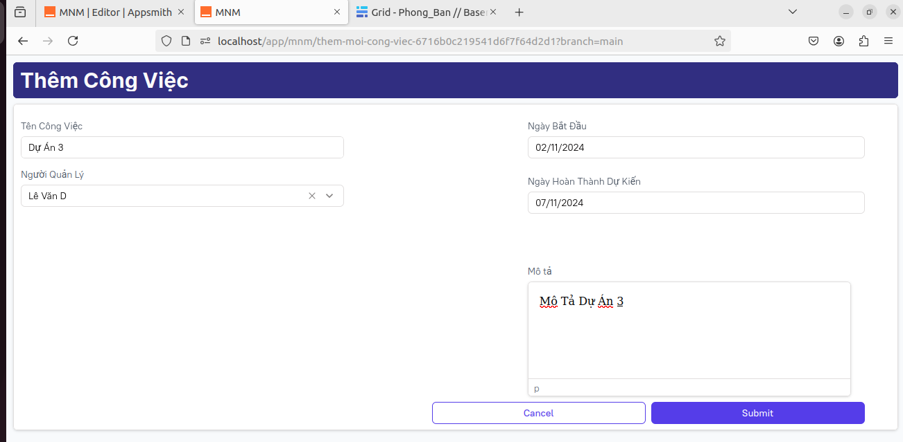
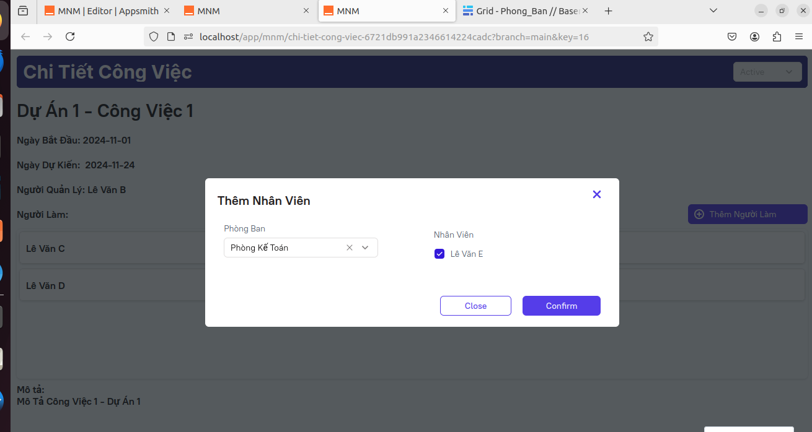

# Appsmith - FITHOU
### Phần mềm làm việc online

Trong bối cảnh xã hội hiện đại, việc quản lý công việc hiệu quả và khoa học là yếu tố quan trọng quyết định năng suất và sự thành công của các cá nhân cũng như tổ chức. Với sự phát triển mạnh mẽ của công nghệ thông tin, các ứng dụng quản lý công việc đã trở thành công cụ không thể thiếu trong việc hỗ trợ người dùng theo dõi, sắp xếp và tối ưu hóa quy trình làm việc.

Từ góc độ của người dùng, quản lý công việc gặp phải nhiều khó khăn trong việc tổ chức thông tin, ghi nhớ và nhắc nhở các nhiệm vụ quan trọng. Trong quản lý tiến độ công việc của các thành viên trong dự án, những thách thức phổ biến bao gồm thiếu sự phối hợp và giao tiếp hiệu quả giữa các thành viên. Ngoài ra, việc theo dõi hiệu suất của từng cá nhân cũng là một nhiệm vụ phức tạp. Đối với quản lý tiến độ chung của dự án, việc duy trì tầm nhìn tổng thể về tiến độ, phát hiện kịp thời các trở ngại và đảm bảo mọi thành viên đều nhận thức rõ mục tiêu chung là vô cùng quan trọn

Phần mềm mong muốn xây dựng các chức năng chính gồm quản lý dự án, phân công công việc, theo dõi tiến độ, giao tiếp cộng tác, báo cáo thống kê công việc giúp người dùng dễ dàng theo dõi và đảm bảo tiến độ công việc.
Qua đó, đồ án mong muốn đóng góp vào việc phát triển các giải pháp công nghệ để nâng cao hiệu suất và tiện ích của việc quản lý công việc, đồng thời thúc đẩy sự phát triển của công nghệ thông tin và ứng dụng trong cuộc sống hàng ngày.

## 🔎 Danh Mục

- [Appsmith - FITHOU](#appsmith---fithou)
    - [Phần mềm làm việc online](#phần-mềm-làm-việc-online)
  - [🔎 Danh Mục](#-danh-mục)
  - [Chức Năng Chính](#chức-năng-chính)
  - [👩‍💻 Tổng Quan Hệ Thống](#-tổng-quan-hệ-thống)
  - [Cấu trúc dự án](#cấu-trúc-dự-án)
  - [Cài Đặt](#cài-đặt)
  - [🙌 Đóng góp cho dự án](#-đóng-góp-cho-dự-án)
  - [📝 License](#-license)

## Chức Năng Chính

Project mong muốn tập trung vào xây dựng các chức năng chính như sau:

-   📋 Tạo và phân công nhiệm vụ (Tasks & Assignments). 
-   📝 Lên lịch và theo dõi tiến độ. 
-   🛎 Thông báo và nhắc nhở. 
-   📃 Quản lý tài liệu dự án.

## 👩‍💻 Tổng Quan Hệ Thống

Backend của nền tảng Appsmith hoạt động như sau:

-   [Spring Framework](https://spring.io/projects/spring-framework): Phát triển các dịch vụ và xử lý logic nghiệp vụ.
-   [MongoDB](https://www.mongodb.com/): Lưu trữ cấu hình, dữ liệu ứng dụng và các metadata liên quan đến widget.
-   [Redis](https://redis.io/): Quản lý cache nhằm tăng tốc độ xử lý và phản hồi.
-   [REST API](https://www.ibm.com/topics/rest-apis): Giao tiếp giữa frontend và backend. 
-   [GraphQL](https://graphql.org/): Để tích hợp với các dịch vụ khác.

## Cấu trúc dự án
- Branch **master**: (default)
  -   [application](./application) - Chứa file json ứng dụng để tải ứng dụng nên nền tảng Appsmith
  -   [appsmith](./appsmith) - Chứa mã nguồn của nền tảng 
  -   [assest](./assets) - Chứa hình ảnh.
  -   [Docs](./docs) - Tài liệu về dự án.
-  Branch **main**: chứa mã nguồn tài nguyên của application

##  Cài Đặt
- [Hướng dẫn sử dụng onl](./docs/README.md)
- Seft-host: 
  -   [Hướng dẫn cài đặt client](./docs/CaiDatClient.md) 
  -   [Hướng dẫn cài đặt server](./docs/CaiDatSerVer.md) 

## DEMO
### 1. Trang Đăng Nhập

Trang Đăng Nhập là điểm truy cập chính cho tất cả người dùng, đảm bảo quyền truy cập an toàn vào các tính năng quản lý công việc và dự án.

Mô tả: Người dùng nhập thông tin tài khoản để đăng nhập vào ứng dụng.

Thông tin nhập:
  - Email
  - Mật khẩu

Thành công: Chuyển hướng người dùng đến bảng điều khiển.

---

### 2. Danh Sách Tài Khoản

Danh Sách Tài Khoản hiển thị tất cả các tài khoản đã đăng ký có quyền truy cập vào ứng dụng.

Mô tả: Chỉ có người dùng có quyền mới có thể xem danh sách các tài khoản, bao gồm thông tin của tài khoản

### 3. Thêm Tài Khoản

Chức năng Thêm Tài Khoản cho phép quản trị viên tạo tài khoản mới cho người dùng.

Mô tả: Nhập thông tin người dùng mới để tạo tài khoản.
Thông tin nhập:
Tên đăng nhập
Vai trò: Chọn vai trò cho tài khoản (ví dụ: Chủ, Nhân viên).

Thành công: Tài khoản mới sẽ xuất hiện trong Danh Sách Tài Khoản, mật khẩu sẽ được tự động khởi tạo là: fithou123.

### 4. Danh Sách Dự Án và Công Việc

Danh Sách Dự Án và Công Việc hiển thị các công việc hiện tại cùng với trạng thái và người quản lý. 2 Trang này sẽ có cấu trúc tương tự nhau, tuy nhiên, trang Quản Lý Công Việc còn có thể sẽ xem được công việc người dùng quản lý và công việc người dùng đang tham gia

Mô tả: Xem danh sách công việc, bao gồm tên công việc, người quản lý, ngày bắt đầu, ngày hòan thành và trạng thái công việc.

Tính năng:
- Xem chi tiết: Nhấn vào tên công việc để xem thông tin chi tiết.
- Cập Nhật Trạng Thái Công Việc

### 6. Thêm Dự Án và Công Việc

Chức năng Thêm Dự Án cho phép tạo một dự mới và chỉ định người quản lý là trưởng các phòng ban, Chức năng Thêm Công Việc cũng sẽ tương tự như vậy nhưng sẽ được thêm bằng cách bấm vào nút thêm công việc con trong trang chi tiết Dự Án

Mô tả: Nhập thông tin công việc mới.

Thông tin nhập:
- Tên công việc
- Mô tả công việc
- Người thực hiện: Chọn người phụ quản lý công việc.
- Thời hạn

Thành công: Công việc mới sẽ xuất hiện trong Danh Sách Công Việc.

### 7. Thêm Người Làm

Chức năng Thêm Người Làm cho phép quản trị viên thêm người vào một công việc.

Mô tả: Thêm thành viên vào một công việc hoặc dự án cụ thể.

Thông tin nhập:
- Chọn Phòng Ban sau đó chọn Người Làm

Thành công: Thành viên mới sẽ xuất hiện trong danh sách người làm của công việc đó.

## 🙌 Đóng góp cho dự án

Mọi đóng góp của các bạn đều được trân trọng, đừng ngần ngại gửi pull request cho dự án.

## 📝 License

This project is licensed under the terms of the [Apache-2.0](LICENSE) license.
